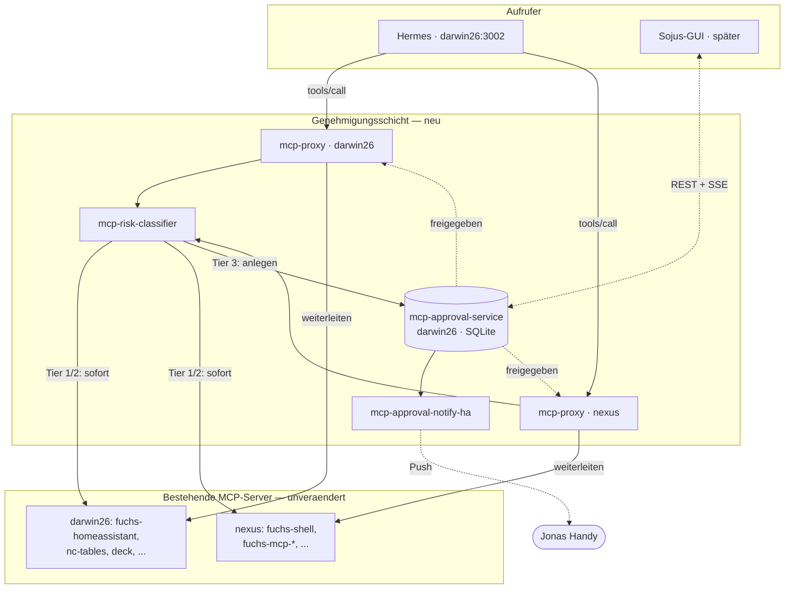

# Eine Genehmigungsschicht für alle MCP-Server

> **Status: Phase 1 implementiert** (mcp-risk-classifier, mcp-approval-service, fuchs-shell umgestellt) — Deploy auf darwin26 + nexus noch offen. Phase 2 (Proxy vor der restlichen Flotte) noch nicht begonnen.
>
> Entscheidungen für Phase 1 (2026-07-29): Bearer-Token + Firewall für Auth (MVP), kein Smart Mode, tool_tiers.json-Format wiederverwendet.

Heute hat nur `fuchs-shell` ein eigenes Tier-Gate. Jeder andere MCP-Server —
`nc_webdav_delete_resource`, `nc_tables_delete_row`, `deck_delete_card` — läuft
komplett ungeprüft. Dieses Konzept zieht Hermes' eigene Idee (Risiko einschätzen,
bei Unsicherheit fragen) aus dem nativen Terminal-Tool heraus und baut sie als
eigenständige, wiederverwendbare Schicht **vor die gesamte MCP-Flotte** — auf
beiden Hosts.

## Kurzfassung

Ein schmaler Reverse-Proxy pro Host (darwin26, nexus) liest jeden `tools/call`
mit, fragt eine gemeinsame Risiko-Bibliothek nach Tier 1/2/3, und hält bei
Tier 3 den Aufruf an, bis ein zentraler Genehmigungs-Service ein Ja oder Nein
bekommen hat — per Push heute, per eigener Sojus-GUI später, ohne dass sich am
Proxy irgendetwas ändern muss. Hermes merkt vom Umbau nichts: gleiche URLs,
gleiche Tools, nur langsamer bei Tier 3.

## Architektur

`mcp-approval-service` lebt einmal zentral auf darwin26 (bei Hermes) — beide
Proxys, egal auf welchem Host, sprechen über die schon bestehende
Firewall-Route darwin26↔nexus mit ihm. Eine Genehmigungs-Warteschlange, nicht
zwei.

## Bausteine — je ein eigenes Nix-Paket

| Paket | Art | Host | Zweck |
|---|---|---|---|
| `mcp-risk-classifier` | Bibliothek | — (Python-Paket, kein Service) | Verallgemeinerte Tier-Logik (aus fuchs-shell herausgezogen): Regex-Muster + Verb-basierte Auto-Klassifizierung wie im alten `tool_tiers.json`, plus optional ein Haiku-Call für unklare Fälle ("smart mode"). Wird von jedem Proxy importiert. |
| `mcp-approval-service` | Service | darwin26 | REST + SSE API, SQLite-Zustand. Nimmt Genehmigungsanfragen an, hält den Status (pending/approved/rejected/expired), benachrichtigt registrierte Notifier, beantwortet Freigaben. Einziger Ort, an dem "Ja"/"Nein" tatsächlich passiert. |
| `mcp-proxy` | Service · 2× | darwin26 + nexus | MCP-Protokoll-bewusster Reverse-Proxy. Liest `tools/call`, alles andere (tools/list, initialize, ...) reicht er 1:1 durch. Übernimmt die Ports, auf denen heute die echten Server hängen; die wandern selbst auf interne Ports. |
| `mcp-approval-notify-ha` | Plugin | läuft im approval-service-Prozess | Erster von potenziell mehreren Notifier-Plugins. Schickt bei neuer Tier-3-Anfrage einen Push über Home Assistant. Die künftige GUI braucht dieses Plugin nicht — sie pollt/abonniert direkt die Service-API. |

## Risiko-Tiers

Gleiche drei Stufen wie schon in fuchs-shell — jetzt aber serverübergreifend, nicht nur für Shell-Befehle.

- **Tier 1 — lesend.** Läuft sofort. `list_*`, `get_*`, `search_*` und Gleichwertiges.
- **Tier 2 — schreibend.** Läuft sofort, wird protokolliert. Nachrichten senden, Termine anlegen, Smart-Home schalten.
- **Tier 3 — destruktiv.** Hält an, braucht Freigabe. `delete_*`, Shell-Execute, `systemctl stop/restart`, nixos-rebuild.

## Ablauf bei Tier 3

1. **Hermes ruft ein Tool auf** — exakt wie heute, gleiche URL. Merkt nicht, dass ein Proxy dazwischenhängt. Kein Hermes-seitiger Umbau nötig.
2. **Proxy fragt mcp-risk-classifier** — Ergebnis: Tier 3.
3. **Proxy legt eine Anfrage bei mcp-approval-service an** — Tool, Argumente, Grund, Zeitstempel. Proxy hält die offene Verbindung, pollt den Status (Timeout ~90s).
4. **approval-service benachrichtigt** — heute per HA-Push, später zusätzlich als Live-Eintrag in der GUI (SSE).
5. **Du entscheidest** — per Freigabe-Aktion aufs Handy oder in der GUI, trifft direkt die Service-API. Das aufrufende Modell hat zu diesem Schritt keinen Zugriff — anders als beim jetzigen Token-Gate.
6. **Freigegeben:** Proxy leitet den ursprünglichen Aufruf an den echten Server weiter, Hermes bekommt das echte Ergebnis. **Abgelehnt/Timeout:** Proxy antwortet mit klarem Fehler, der Backend-Server wird nie berührt.

## mcp-approval-service — API

Der Vertrag, gegen den später sowohl der Proxy als auch die eigene GUI programmieren — deshalb zuerst festlegen.

| Methode | Pfad | Zweck |
|---|---|---|
| `POST` | `/approvals` | Neue Anfrage anlegen (vom Proxy) — Tool, Server, Argumente, Tier, Begründung |
| `GET` | `/approvals` | Offene + letzte Anfragen auflisten — für die GUI-Warteschlange |
| `GET` | `/approvals/{id}` | Status einer einzelnen Anfrage (vom Proxy gepollt) |
| `POST` | `/approvals/{id}/approve` | Freigeben, optionaler Kommentar |
| `POST` | `/approvals/{id}/reject` | Ablehnen, optionaler Grund |
| `GET` | `/approvals/stream` | SSE — neue Anfragen live, für die GUI |

## Vorschlag: in zwei Phasen bauen

**Phase 1 — Service zuerst, klein anfangen**
- mcp-risk-classifier + mcp-approval-service + HA-Notifier bauen
- fuchs-shell auf die neue API umstellen, eigenes Token-Gate raus
- Beweist den API-Vertrag an einem einzelnen, schon riskantesten Server
- Kein Proxy, kein Port-Umbau nötig — kleiner Blast-Radius

**Phase 2 — Proxy vor die restliche Flotte**
- mcp-proxy für darwin26 + nexus bauen
- Bestehende Server auf interne Ports, Proxy übernimmt die öffentlichen
- hermes.nix-URLs bleiben gleich (zeigen jetzt auf den Proxy)
- Server für Server migrieren, nicht alles auf einmal

## Offene Entscheidungen

Bevor Phase 1 losgeht, braucht es hierzu ein Ja/Nein bzw. eine Wahl:

1. **Auth für die approval-service-API.** MVP: geteilter Bearer-Token, Firewall-only wie bei den anderen MCP-Servern. Später an LDAP/Nextcloud koppeln, sobald die GUI steht?
2. **"Smart mode" — Haiku-Risikoeinschätzung für Grenzfälle.** Kostet einen zusätzlichen API-Call + Latenz pro unklarem Tool-Aufruf. Für v1 drin lassen oder erstmal nur Regex, smart mode als Phase 3?
3. **Port-Umbau in Phase 2.** Jeder bestehende MCP-Server wandert auf einen internen Port, der Proxy übernimmt den öffentlichen. Betrifft praktisch jedes `*.nix`-Modul — alles auf einmal oder Server für Server?
4. **Tier-Konfiguration pro Server.** Altes `tool_tiers.json`-Format (Verb-Auto-Klassifizierung + Overrides) wiederverwenden und um MCP-Tool-Namen erweitern, oder neu denken?
